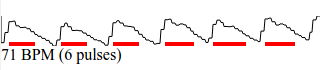

# HeartRate

An online heart-rate monitor that uses your Webcam. Place your finger over your phone's camera and hold it there gently, and it should be able to work out your heartrate.

Uses getUserMedia

<a href="https://gfwilliams.github.io/HeartRate/">Try it out!</a>
